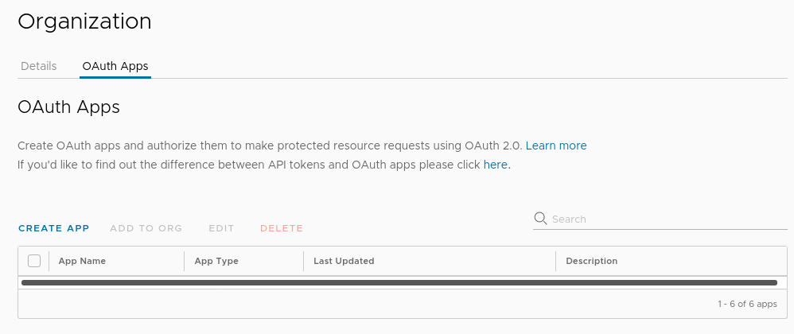
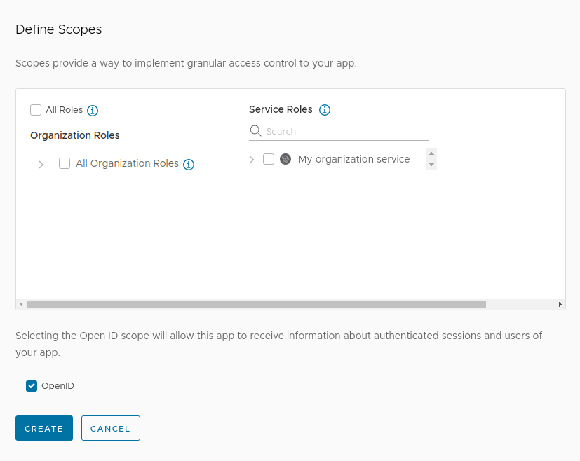

# Step 1 - Configure an Identity Management Provider in your Cluster

## 1.1 - TBD Install or use the existing Pinniped in TKG?

<!--

This section depends upon the result of the issue https://github.com/kubeapps/kubeapps/issues/2764

Therefore three possible approaches are on the table:

    a) TKG eventually will bundle a  Pinniped version >= 0.6: this step will just refer to the TKG official docs.

    b) TKG has a Pinniped version < 0.6 AND we can install a newer Pinniped manually: this step will hold the information about how to install it manually OR via TMC.

    c) TKG has a Pinniped version < 0.6 AND we CANNOT install a newer Pinniped manually: we have a major issue here: we can either refer to the latest Kubeapps version working with Pinniped pre 0.6 OR perform a barckport
    ew cluster-scoped resources (ie. > 0.6.0).

> The guide below assumes no TMC

-->

- [Enabling Identity Management in Tanzu Kubernetes Grid](https://docs.vmware.com/en/VMware-Tanzu-Kubernetes-Grid/1.3/vmware-tanzu-kubernetes-grid-13/GUID-mgmt-clusters-enabling-id-mgmt.html).
- [Tanzu Kubernetes Grid 1.3 with Identity Management](https://liveandletlearn.net/post/kubeapps-on-tanzu-kubernetes-grid-13/)

At this point, you will have a TKG cluster with Pinniped up and running. Next, the next section you will configure Pinniped to trust your favorite OIDC provider.

## 1.2 - Configure an OIDC Provider

In this section, we configure an OIDC provider that will authenticate users in our TKG cluster as well as in the Kubeapps dashboard. We will use the [VMware Cloud Services Platform (CSP)](https://console.cloud.vmware.com/) as the running example; nontheless, any OIDC-compliant provider (such as Google Cloud, Azure Active Directoy, Dex, Okta, etc. ) can be also configured.
Please refer to the Kubeapps documentation on [using an OAth2/OIDC provider](https://github.com/kubeapps/kubeapps/blob/master/docs/user/using-an-OIDC-provider.md) for further information.

### Create an OAuth2 Application inside CSP

We need to create an OAuth2 application in order to retrieve the information required by Pinniped and, later on, Kubeapps. To do so, follow the following steps:

> **NOTE**: You must have _Developer_ access in the organization to perform these steps.

1. Go to the CSP Console available at [https://console.cloud.vmware.com](https://console.cloud.vmware.com/).
2. Under the _Organization_ settings of the right menu, click on _View Organization_
   
3. Click on the _OAuth Apps_ tab.
   
4. Select _Web app_ and click on _continue_.
   
5. Enter a name and description for your OAuth app. Besides, add any URL as the _Redirect URIs_ as we will edit it once we install Kubeapps. For instance, enter `https://localhost/oauth2/callback`.
   
6. Leave the rest of the options with the default values.
7. Enable the _OpenID_ checkbox and click on _create_.
   
8. You will now see a dialog with the _app id_ and _app secret_. Click on the _Download JSON_ option as there is other useful info in the JSON.
   

At this point, you have the _app id_ and _app secret_ (also known as _client id_ and _client secret_). These values will be required in subsequent steps when configuring Pinniped and Kubeapps. Also, remember that we will need to edit the _Redirect URI_ once we install Kubeapps.

> **TIP**: Any OIDC-compliant provider should expose a `.well-known/openid-configuration` ([example](https://console.cloud.vmware.com/csp/gateway/am/api/.well-known/openid-configuration)) endpoint where you can find other useful and required information. It will allow just just using the base URL to discover the rest of the URLs (authorization, token, end session, jwks and issuer) automatically.
> That is, for CSP we will use henceforth this one: `https://console-stg.cloud.vmware.com/csp/gateway/am/api`.

### Make Pinniped Trust your OIDC Provider

Once the OIDC provider has been fully configured, we need Pinniped to trust this provider, so that a sucessful authentication in the OIDC provicer results in an authentication in our TKG cluster.

Since Pinniped is already hiding the complexity of this process, we just need to add a _JWTAuthenticator_ CustomResource in our cluster. To to so, simply edit the following excerpt accordingly and apply it into your TKG cluster.

> **TIP**: a look at [JWTAuthenticator official documentation](https://pinniped.dev/docs/howto/configure-concierge-jwt/) for further information.

1. Create a file `my-jwt-authenticator.yaml` with the following content:

```yaml
---
apiVersion: authentication.concierge.pinniped.dev/v1alpha1
kind: JWTAuthenticator
metadata:
  name: my-jwt-authenticator
spec:
  issuer: my-oidc-issuer-url
  audience: my-client-id # modify this value accordingly
  claims:
    username: email
  # tls:
  # certificateAuthorityData: LS0t... # optional base64 CA data if using a self-signed certificate
```

2. Replace `my-oidc-issuer-url` by the _issuer_ URL of your OIDC provider. For CSP it is: `https://console-stg.cloud.vmware.com/csp/gateway/am/api`
3. Replace `my-client-id` by the _app id_ you got on the previous section.
4. Ignore the `tls` section unless your OIDC uses a self-signed certificate. If so, follow [this additional guide](https://github.com/kubeapps/kubeapps/blob/master/docs/user/using-an-OIDC-provider-with-pinniped.md#pinniped-not-trusting-your-oidc-provider).
5. Perform a `kubectl apply -f my-jwt-authenticator.yaml` to install the JWTAuthenticator in your cluster.

## Additional References

- [VMware Cloud Services as OIDC provider](https://github.com/kubeapps/kubeapps/blob/master/docs/user/using-an-OIDC-provider.md#vmware-cloud-services)
- [Using an OIDC provider with Pinniped](https://github.com/kubeapps/kubeapps/blob/master/docs/user/using-an-OIDC-provider-with-pinniped.md)
