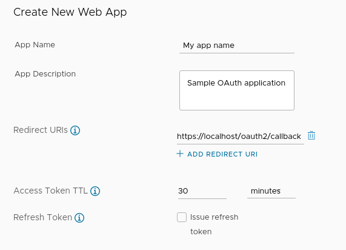
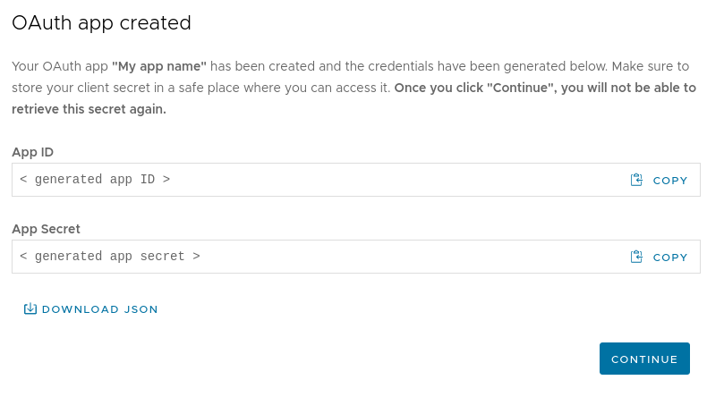

# Step 1 - Configure an Identity Management Provider in your Cluster

In this step, we will install a more recent Pinniped version compatible with Kubeapps. Next, we will configure from scratch an OIDC provider (using VMware CSP as an example) and will make Pinniped trust this provider for authenticating the Kubernetes API calls. At the end of this guide, your TKG cluster will be ready to perform a Kubeapps installation.

## 1.1 - Install a recent Pinniped version

As per TKG 1.3.1, the built-in Pinniped version is pretty old (`0.4.1`) and it has some incompatibilities with the latest Kubeapps versions. Fortunately, Pinniped can be instaled multiple times as a standalone product (i.e., not as a TKG addon) in a separate namespace and using a different Kubernetes API group.

Specifically, Kubeapps require a Pinniped greater or equal to `0.6.0`, so in this subsection we will cover how to install a recent Pinniped version (e.g., `0.8.0`) in your TKG cluster without interferring your existing version provided as a TKG addon.

Alternatively, you can safely skip this section if you [attach the cluster to VMware Tanzu™ Mission Control™](https://docs.vmware.com/en/VMware-Tanzu-Mission-Control/services/tanzumc-getstart/GUID-F0162E40-8D47-45D7-9EA1-83B64B380F5C.html). By attaching a cluster in TMC you will automatically get a recent Pinniped version installed in your cluster, ready to use along with Kubeapps.

> **NOTE**: Whereas users can install Pinniped in any namespace with any API group, due to current limitations in Kubeapps, the list of supported combination of namespace/API groups is limited to:
>
> - `*.pinniped-dev` resources in the `pinniped-concierge` namespace.
> - `*.pinniped.tmc.cloud.vmware.com` in the `vmware-system-tmc` namespace.
>   However, note that, even though the `tmc` name appears there, it is just a name required for technical reasons. There is no need of using TMC for running Kubeapps on TKG.

In order to install a recent Pinniped version in TKG (e.g., `0.8.0`), please follow these steps:

1. Before applying any `yaml` file in yout cluster, you first need to change the API group and namespace with a supported one. There are a couple of options to do so:
   - Use the provided file at [./manifests/pinniped-0.8-tmc.yaml](./manifests/pinniped-0.8-tmc.yaml) which will install Pinniped Concierge v0.8.0 deployed as `pinniped-concierge-0-8-0` in the `vmware-system-tmc` namespace with the `*.pinniped.tmc.cloud.vmware.com` API group.
   - Follow the [official documentation](https://pinniped.dev/docs/howto/install-concierge/) and use the `ytt` tool from [Carvel](https://carvel.dev/) to generate a new `yaml` file to apply. Specify, you will need to edit:
     - `app_name`: set it to `pinniped-concierge-0-8-0` (or any name of your choice).
     - `namespace`: set it to `vmware-system-tmc`.
     - `image_tag`: set it to `v0.8.0` (or any version, >= v0.6.0, of your choice).
     - `api_group_suffix`: set it to `pinniped.tmc.cloud.vmware.com`.
   - Download the [`v0.8.0` Piniped Concierge official release](https://github.com/vmware-tanzu/pinniped/releases/download/v0.8.0/install-pinniped-concierge.yaml) and manually edit the versions and namespaces accordingly (not recommended).
     > **NOTE**: remember, even though you have to enter `tmc`, you do not need to have access to TMC whatsoever.
2. Save the `yaml` file generated above; for instance, `pinniped-0.8-tmc.yaml`.
3. Apply this file; for instance: `kubectl apply -f pinniped-0.8-tmc.yaml`
4. Verify it has been installed and the image is correct: `kubectl get deploy/pinniped-concierge-0-8-0 -n pinniped-concierge-0-8-0 -oyaml | grep image`

At this point, you will have a TKG cluster with a compatible Pinniped version (e.g., `0.8.0`) up and running. Next, the next section will guide you configuring it to trust your favorite OIDC provider.

## 1.2 - Configure an OIDC Provider

In this section, we configure an OIDC provider that will authenticate users in our TKG cluster as well as in the Kubeapps dashboard. We will use the [VMware Cloud Services Platform (CSP)](https://console.cloud.vmware.com/) as the running example; nonetheless, any OIDC-compliant provider (such as Google Cloud, Azure Active Directory, Dex, Okta, etc. ) can be also configured.
Please refer to the Kubeapps documentation on [using an OAth2/OIDC provider](https://github.com/kubeapps/kubeapps/blob/master/docs/user/using-an-OIDC-provider.md) for further information.

### Create an OAuth2 Application inside CSP

We need to create an OAuth2 application in order to retrieve the information required by Pinniped and, later on, Kubeapps. To do so, follow the following steps:

> **NOTE**: You must have _Developer_ access in the organization to perform these steps.

1. Go to the CSP Console available at [https://console.cloud.vmware.com](https://console.cloud.vmware.com/).
2. Under the _Organization_ settings of the right menu, click on _View Organization_
   
3. Click on the _OAuth Apps_ tab.
   
4. Select _Web app_ and click on _continue_.
   
5. Enter a name and description for your OAuth app. Besides, add any URL as the _Redirect URIs_ as we will edit it once we install Kubeapps. For instance, enter `https://localhost/oauth2/callback`.
   
6. Leave the rest of the options with the default values.
7. Enable the _OpenID_ checkbox and click on _create_.
   
8. You will now see a dialog with the _app id_ and _app secret_. Click on the _Download JSON_ option as there is other useful info in the JSON.
   

At this point, you have the _app id_ and _app secret_ (also known as _client id_ and _client secret_). These values will be required in subsequent steps when configuring Pinniped and Kubeapps. Also, remember that we will need to edit the _Redirect URI_ once we install Kubeapps.

> **TIP**: Any OIDC-compliant provider should expose a `.well-known/openid-configuration` ([example](https://console.cloud.vmware.com/csp/gateway/am/api/.well-known/openid-configuration)) endpoint where you can find other useful and required information. It will allow just using the base URL to discover the rest of the URLs (`authorization`, `token`, `end session`, `jwks` and `issuer`) automatically.
> That is, for CSP, we will use henceforth this one: `https://console-stg.cloud.vmware.com/csp/gateway/am/api`.

### Make Pinniped Trust your OIDC Provider

Once the OIDC provider has been fully configured, we need Pinniped to trust this provider, so that a successful authentication in the OIDC provider results in authentication in our TKG cluster.

Since Pinniped is already hiding the complexity of this process, we just need to add a _JWTAuthenticator_ CustomResource in our cluster. To do so, simply edit the following excerpt accordingly and apply it to your TKG cluster.

> **TIP**: a look at [JWTAuthenticator official documentation](https://pinniped.dev/docs/howto/configure-concierge-jwt/) for further information.

1. Create a file `kubeapps-jwt-authenticator.yaml` with the following content:

```yaml
---
apiVersion: authentication.concierge.pinniped.tmc.cloud.vmware.com/v1alpha1
kind: JWTAuthenticator
metadata:
  name: kubeapps-jwt-authenticator
spec:
  issuer: my-oidc-issuer-url
  audience: my-client-id # modify this value accordingly
  claims:
    username: email
#   tls:
#     certificateAuthorityData: LS0t... # optional base64 CA data if using a self-signed certificate
```

2. Replace `my-oidc-issuer-url` with the _issuer_ URL of your OIDC provider. For CSP it is: `https://console-stg.cloud.vmware.com/csp/gateway/am/api`.
3. Replace `my-client-id` by the _app id_ you got in the previous section.
4. Ignore the `tls` section unless your OIDC uses a self-signed certificate. If so, follow [this additional guide](https://github.com/kubeapps/kubeapps/blob/master/docs/user/using-an-OIDC-provider-with-pinniped.md#pinniped-not-trusting-your-oidc-provider).
5. Perform a `kubectl apply -f kubeapps-jwt-authenticator.yaml` to install the JWTAuthenticator in your cluster.

> **TIP**: If you are using more that one workload cluster, you should apply this `JWTAuthenticator` in every cluster.

## What to Do Next?

Now you have a TKG cluster with a recent Pinniped instance fully configured to trust your OIDC provider, it is time to [configure and install Kubeapps as described in Step 2](./step-2.md).

## Additional References

- [VMware Cloud Services as OIDC provider](https://github.com/kubeapps/kubeapps/blob/master/docs/user/using-an-OIDC-provider.md#vmware-cloud-services)
- [Using an OIDC provider with Pinniped](https://github.com/kubeapps/kubeapps/blob/master/docs/user/using-an-OIDC-provider-with-pinniped.md)
