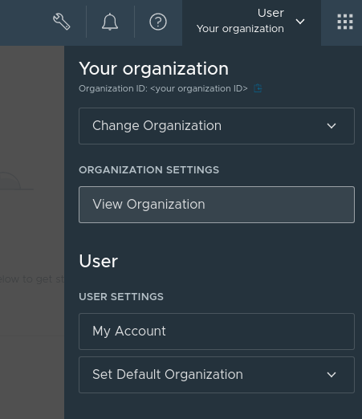
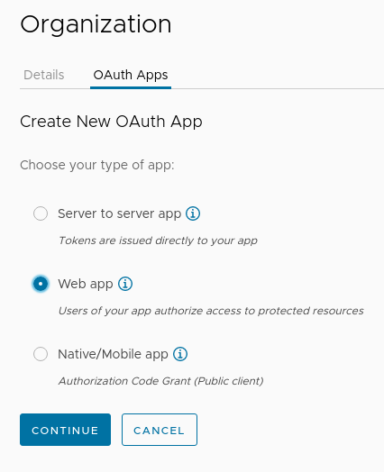

## Step 1: Configure an Identity Management Provider in the Cluster

The first step is to configure an OIDC provider ([VMware Cloud Service Portal (CSP)](https://console.cloud.vmware.com) login in this example) in the VMware Tanzu™ Kubernetes Grid™ (TKG) cluster and configure Pinniped to trust this provider for authenticating Kubernetes API calls.

### Step 1.1: Install a Recent Version of Pinniped

> **NOTE**: Skip this section if [the cluster is already attached or will be attached to VMware Tanzu™ Mission Control™ (TMC)](https://docs.vmware.com/en/VMware-Tanzu-Mission-Control/services/tanzumc-getstart/GUID-F0162E40-8D47-45D7-9EA1-83B64B380F5C.html). When a cluster is attached to TMC a recent Pinniped version compatible with Kubeapps is automatically installed in your cluster.

As per TKG v1.3.1, the built-in Pinniped version is relatively old (v0.4.1) and has some incompatibilities with the current Kubeapps releases. Specifically, Kubeapps requires Pinniped v0.6.0 or higher. However, Pinniped can be installed multiple times as a standalone product (not as a _TKG addon)_ in separate namespaces and using different Kubernetes API groups.

> **NOTE**: Although users can install Pinniped in any namespace with any API group, due to current limitations in Kubeapps, the list of supported combination of namespace/API groups is limited to:
>
> - `*.pinniped-dev` resources in the `pinniped-concierge` namespace.
> - `*.pinniped.tmc.cloud.vmware.com` in the `vmware-system-tmc` namespace.
>   However, note that, even though the `tmc` name appears in the above namespace, it is only required for technical reasons. There is no requirement to use TMC when running Kubeapps on TKG.

In order to install a recent Pinniped version in TKG (this guide uses v0.8.0), follow the steps below:

1. Change the Kubernetes API group and namespace to a supported one. This can be done in a number of different ways, described below:

   - Use the provided file at [./manifests/pinniped-0.8-tmc.yaml](./manifests/pinniped-0.8-tmc.yaml) which will install Pinniped Concierge v0.8.0 deployed as `pinniped-concierge-0-8-0` in the `vmware-system-tmc` namespace with the `*.pinniped.tmc.cloud.vmware.com` API group.
   - Follow the [official documentation](https://pinniped.dev/docs/howto/install-concierge/) and use the `ytt` tool from [Carvel](https://carvel.dev/) to generate a new `yaml` file to apply. Specify, you will need to edit the following parameters:
     - `app_name`: Set it to `pinniped-concierge-0-8-0` (or any name of your choice).
     - `namespace`: Set it to `vmware-system-tmc`.
     - `image_tag`: Set it to `v0.8.0` (or any version, >= v0.6.0, of your choice).
     - `api_group_suffix`: Set it to `pinniped.tmc.cloud.vmware.com`.
   - Download the [v0.8.0 Piniped Concierge official release](https://github.com/vmware-tanzu/pinniped/releases/download/v0.8.0/install-pinniped-concierge.yaml) and manually edit the versions and namespaces accordingly (not recommended).

   > **NOTE**: Although some of the options described above use namespaces or group names containing `tmc`, this is only required for technical reasons. There is no requirement to use TMC when running Kubeapps on TKG.

2. Save the `yaml` file generated at the end of the previous step.
3. Apply this file to the cluster:

```bash
kubectl apply -f pinniped-0.8-tmc.yaml
```

4. Confirm that Pinniped has been installed and the image is correct:

```bash
kubectl get deploy/pinniped-concierge-0-8-0 -n pinniped-concierge-0-8-0 -oyaml | grep image
```

At this point, a TKG cluster with a compatible Pinniped version is up and running.

### Step 1.2: Configure an OIDC Provider

The next step is to configure an OIDC provider and then configure Pinniped to trust the OIDC provider. The OIDC provider is responsible for authenticating users in the TKG cluster and the Kubeapps dashboard. The steps below use the [VMware Cloud Services Platform (CSP)](https://console.cloud.vmware.com/) as an example; however, a similar process applies to any other OIDC-compliant provider, including Google Cloud, Azure Active Directory, Dex, Okta, and others.

#### Create an OAuth2 Application

Begin by creating an OAuth2 application to retrieve the information required by Pinniped and, later on, Kubeapps. Follow the steps below:

> **NOTE**: You must have _Developer_ access in the organization to perform these steps.

1. Navigate to the CSP Console at [https://console.cloud.vmware.com](https://console.cloud.vmware.com/).
2. Click the drop-down menu in the top-right corner.
3. Under the _Organization_ settings, click _View Organization_.
   
4. Click the _OAuth Apps_ tab.
   
5. Select _Web app_ and click the _Continue_ button.
   
6. Enter a name and description for the OAuth app. For the moment, enter the value `https://localhost/oauth2/callback` in the _Redirect URIs_ field (this will be updated after Kubeapps is installed).
   
7. Leave the rest of the options at their default values.
8. Tick the _OpenID_ checkbox and click the _Create_ button.
   

The CSP Console displays a success screen with an auto-generated application ID and secret. Click the _Download JSON_ link to download these values.


> **NOTE**: Store this file carefully as it contains important credentials which will be needed when configuring Pinniped and Kubeapps.

> **TIP**: Any OIDC-compliant provider should expose a `.well-known/openid-configuration` ([example](https://console.cloud.vmware.com/csp/gateway/am/api/.well-known/openid-configuration)) endpoint where you can find other useful and required information. This endpoint allows using the base URL to discover the rest of the URLs (`authorization`, `token`, `end session`, `jwks` and `issuer`) automatically. For CSP, the endpoint is `https://console-stg.cloud.vmware.com/csp/gateway/am/api`.

At this point, an OAuth2 application is configured.

### Configure Pinniped to Trust the OIDC Provider

Once the OIDC provider has been fully configured, the next step is to configure Pinniped to trust this provider. This implies that a successful authentication with the OIDC provider results in authentication with the TKG cluster.

Since Pinniped manages this process, the only requirement is to a _JWTAuthenticator_ CustomResource in the cluster. To do so, follow the steps below:

1. Create a file named `kubeapps-jwt-authenticator.yaml` with the following content. Replace the placeholders as follows:

- Replace the `OIDC-ISSUER-URL` with the issuer URL of the OIDC provider. For CSP it is `https://console-stg.cloud.vmware.com/csp/gateway/am/api`.
- Replace `CLIENT-ID` with the application ID obtained from the JSON file in the previous step.

```yaml
---
apiVersion: authentication.concierge.pinniped.tmc.cloud.vmware.com/v1alpha1
kind: JWTAuthenticator
metadata:
  name: kubeapps-jwt-authenticator
spec:
  issuer: OIDC-ISSUER-URL
  audience: CLIENT-ID
  claims:
    username: email
#   tls:
#     certificateAuthorityData: LS0t... # optional base64 CA data if using a self-signed certificate
```

The `name` field specifies the name of the _JWTAuthenticator_ resource, which will be required in the next step.

> **NOTE**: Ignore the `tls` section of the configuration shown above unless the OIDC uses a self-signed certificate. If it does, follow [these additional steps](https://github.com/kubeapps/kubeapps/blob/master/docs/user/using-an-OIDC-provider-with-pinniped.md#pinniped-not-trusting-your-oidc-provider).

2. Install the _JWTAuthenticator_ resource in your cluster:

```bash
kubectl apply -f kubeapps-jwt-authenticator.yaml
```

> **TIP**: When using more than one workload cluster, apply this _JWTAuthenticator_ resource in every cluster.

At the end of this step, an identity management provider has been configured in the cluster. The next step is to [install Kubeapps](./step-2.md).
